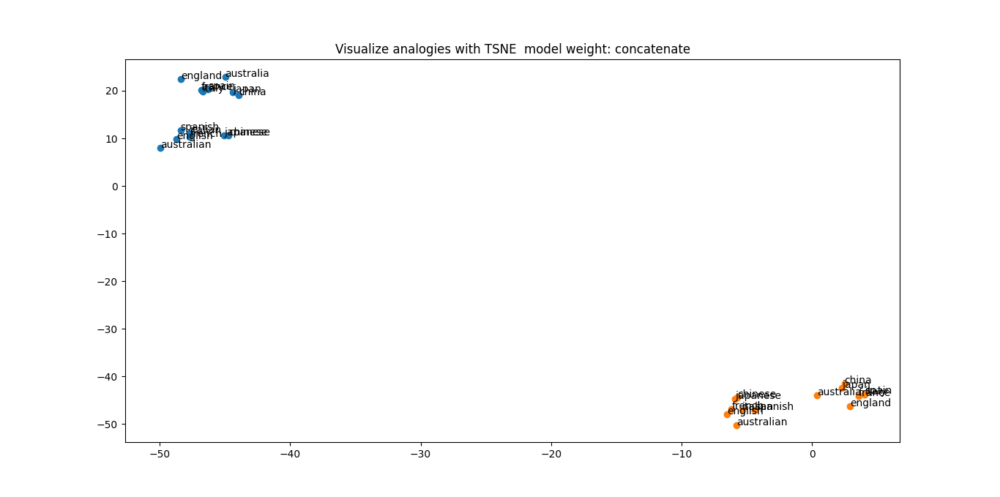
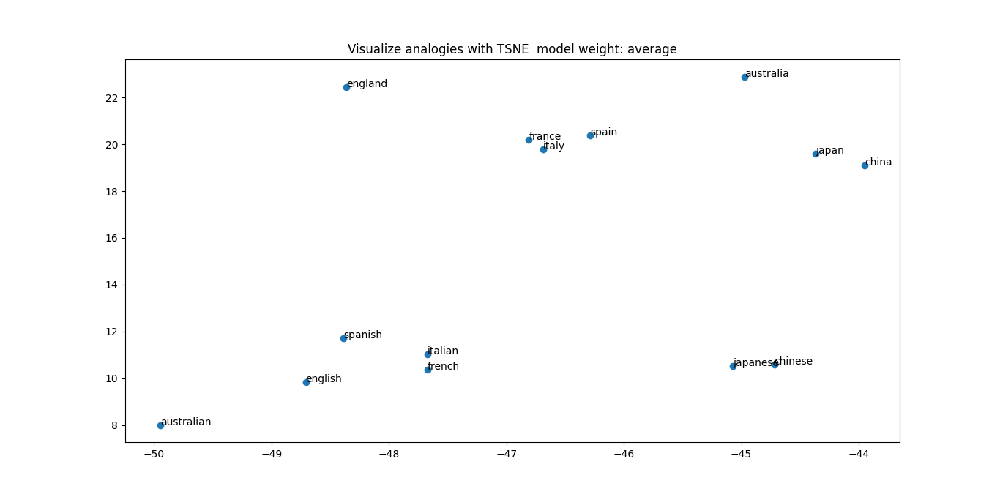
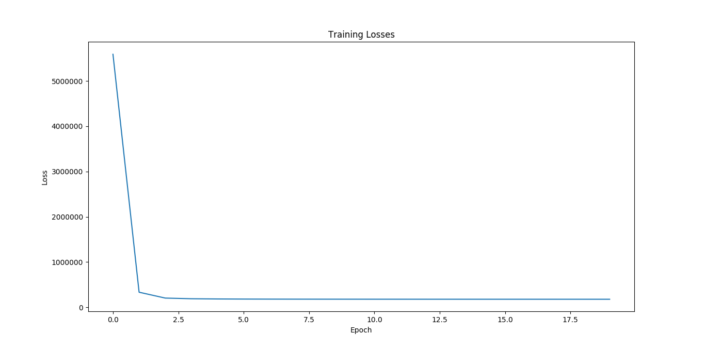
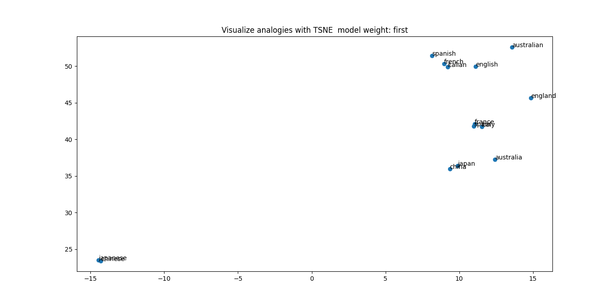

# Directory Structure
```text
.
├── embeddings
│   ├── glove_model_50sxs99.npz
│   └── w2i.json
├── figure
│   └── Figure_training.png
├── floyd_requirements.txt
├── floyd.yml
├── models
│   ├── embeddings.py
│   ├── __init__.py
│   └── nn.py
├── preds
│   ├── king-top_neighs-average-guz.txt
│   └── king-top_neighs-concat-bln.txt
├── README.md
├── run.py
├── utils
│   ├── data.py
│   ├── embedding
│   │   ├── bigram.py
│   │   ├── data.py
│   │   ├── __init__.py
│   │   └── sentence.py
│   ├── exps.py
│   ├── __init__.py
│   ├── network
│   │   ├── glove.py
│   │   └── __init__.py
│   ├── params.py
│   └── plot.py
└── weights
    └── glove_model_50.npz

8 directories, 24 files
```


# Data - Wikipedia Data Sentences

```text
Use the Wikiextractor tool or
```
[Wikiextractor Tool](https://github.com/attardi/wikiextractor)
```text
Download from the Extra Section
```
[Data from Lazy Programmer](https://deeplearningcourses.com/c/natural-language-processing-with-deep-learning-in-python)

# Build the GloVe N-Gram Embedding with 1 Hidden Layer FeedForward network

## Embedding & Model Parameters
```text
vocab size: 2000
```
```text
hidden dim: 100
```
```text
input dim: vocab size
```
```text
output dim: vocab_size
```
```text
max n-gram: 10
```

## Training Parameters
```text
max n-gram window size: 10
```
```text
learning rate: 0.0001
```

```text
epochs: 20
```

## CLI
```shell
python run.py --load no
```

# Load N-Gram GloVe model
```shell
python run.py --load yes
```


# Experiment 1 - Word Nearest Neighbours
```text
So, We have 2 word embedding matrices and what do I do with them?
```
```text
Which one should I choose?
```

### Sub Experiment - Concatenate Input & Hidden Weights
## Word
```text
king
```
## Top 10 Nearest Neghbours with distances
|      |     henry |     queen |       son |    prince |   charles |     duke |    louis |   father |   emperor |
|:-----|----------:|----------:|----------:|----------:|----------:|---------:|---------:|---------:|----------:|
| king | 0.0742102 | 0.0787175 | 0.0865505 | 0.0902269 | 0.0914884 | 0.101578 | 0.103746 | 0.105445 |  0.105927 |

### Sub Experiment - Take the Average of two matrices
## Word
```text
king
```

## Top 10 Nearest Neghbours with distances
|      |     henry |   charles |     queen |      son |   prince |   edward |    louis |     duke |   father |
|:-----|----------:|----------:|----------:|---------:|---------:|---------:|---------:|---------:|---------:|
| king | 0.0750687 | 0.0893572 | 0.0900342 | 0.092791 |  0.10205 | 0.107328 | 0.108777 | 0.115705 | 0.120697 |


# Experiment 2 - Word Analogy

```text
positive: king
```
```text
negative: man
```
```text
positive: woman
```
```text
equation: king - man + woman
```
```text
solution: queen
```

# Experiment 3 - Visualize country analogies with t-SNE
```text
Countries: japan japanese england english australia australian china chinese italy italian french france spain spanish
```
### Sub Experiment - Concatenate Input & Hidden Weights



### Sub Experiment - Take the Average of two matrices

# Training Procedure



# Load PMI  model
```shell
python run.py --load yes
```


# Experiment 1 - Word Nearest Neighbours


## Word
```text
king
```
## Top 10 Nearest Neghbours with distances
|      |    prince |    throne |     duke |    henry |      iii |    queen |       iv |   charles |      son |
|:-----|----------:|----------:|---------:|---------:|---------:|---------:|---------:|----------:|---------:|
| king | 0.0888272 | 0.0973404 | 0.107005 | 0.111335 | 0.133846 | 0.139248 | 0.141681 |  0.144009 | 0.153965 |


# Experiment 2 - Word Analogy

```text
positive: king
```
```text
negative: man
```
```text
positive: woman
```
```text
equation: king - man + woman
```
```text
solution: prince
```

# Experiment 3 - Visualize country analogies with t-SNE
```text
Countries: japan japanese england english australia australian china chinese italy italian french france spain spanish
```



# Training Procedure
.png)


# Docker for the N-Gram GloVe model

## Build the Docker image

You can build docker image by following:

```shell
docker-compose build
```

## Run Docker container

You can launch a container from the Docker image by following:

```shell
docker-compose up
```


# Under The Maintenance...

